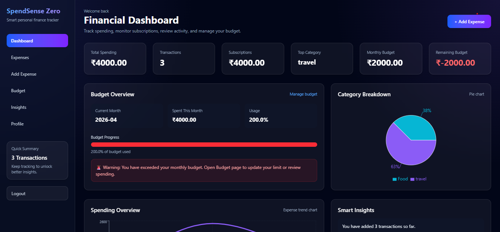
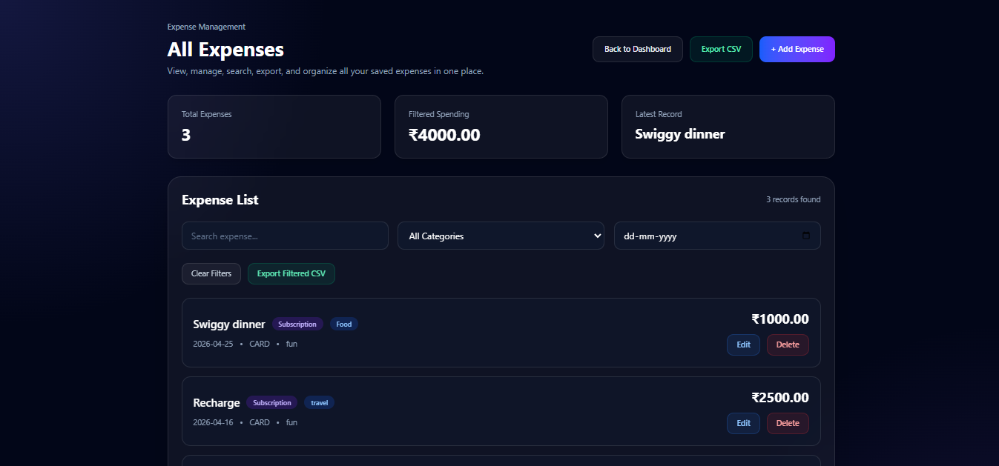
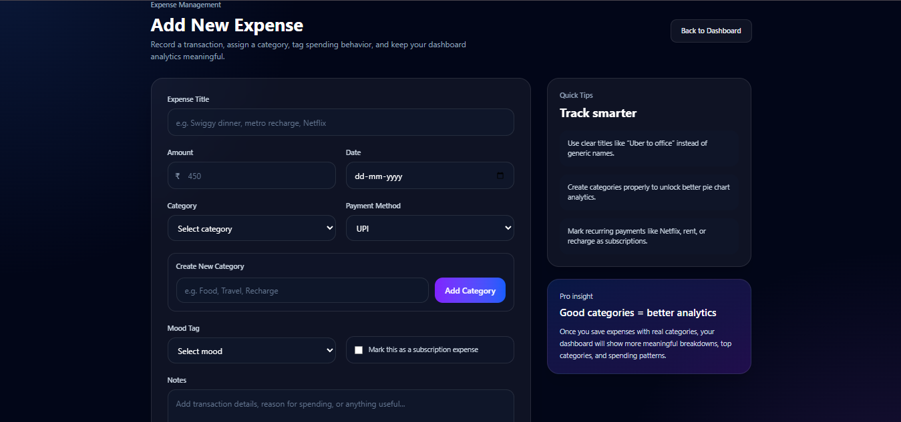
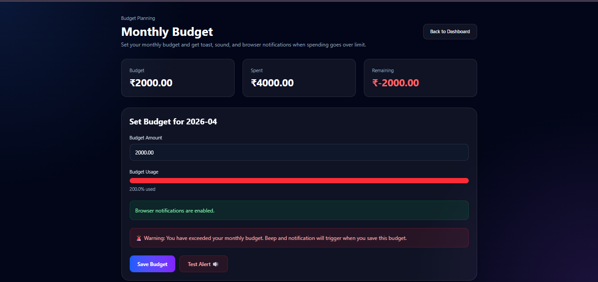
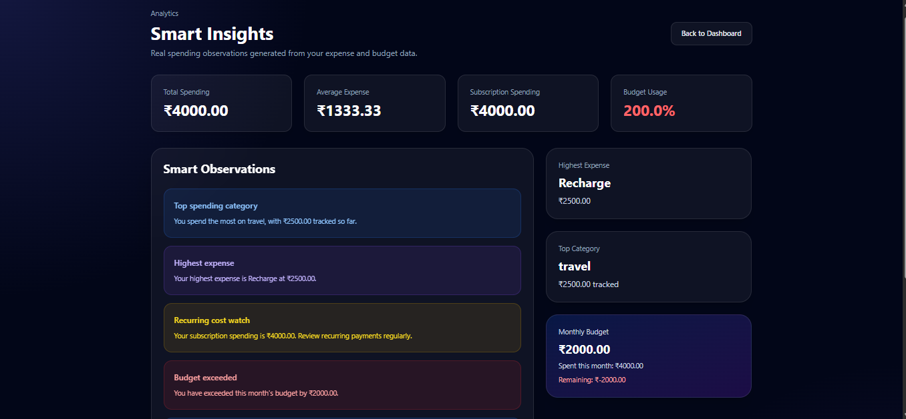

# 💸 SpendSense Zero

A full-stack personal finance tracker built using React and Django REST Framework.

---

## 🚀 Features

- 🔐 JWT Authentication (Login/Register)
- 💰 Expense Management (Add, Edit, Delete)
- 📊 Dashboard with Charts
- 📅 Monthly Budget Tracking
- 🔔 Browser Notifications for budget alerts
- 🔊 Sound alert when budget exceeded
- 📁 CSV Export
- 🧠 Smart Insights
- 🎨 Modern UI (Tailwind CSS)

---

## 🛠️ Tech Stack

- Frontend: React + Vite + Tailwind CSS
- Backend: Django + Django REST Framework
- Authentication: JWT
- Charts: Recharts

---

## 📸 Screenshots

### Dashboard

### Expenses

### Add Expense

### Budget Alert

### Insights

## ▶️ Demo

(Add your demo video link here)

---

## 📂 GitHub

https://github.com/ishika16435/spendsense-zero

---

## 💡 Project Type

Portfolio Project (Full Stack)

---

## 🙌 Author

Ishika
